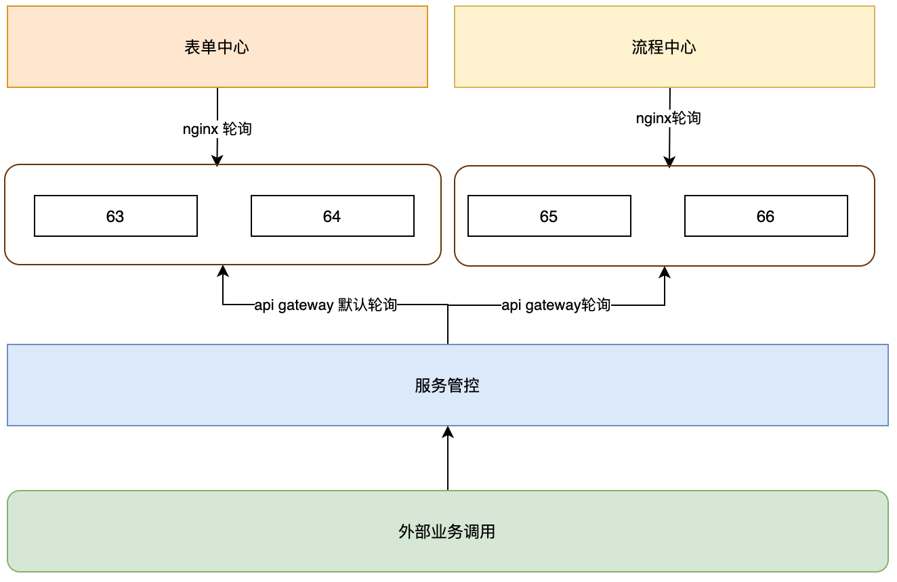

# 部署架构

## 基础环境

### 达梦数据

#### 流程中心:

* host: 10.30.161.53 
* 端口 5236
* 用户名  PROCESSUSR
* 密码  O/tiWliP8DDs
* 表空间  UNIFIEDPROCESSPROD

#### 表单中心:

* host 10.30.161.53 
* 端口 5236 
* 用户名  FORMUSR 
* 密码  jPNMKZnJw6e9   
* 表空间  UNIFIEDFORMPROD 

### Redis

redis使用sentinel模式搭建，一主一备模式部署在应用服务器；

#### 流程中心:

* Host: 10.30.161.65/66
* 端口 26379
* 密码 dGRSPZjjCAgj

#### 表单中心:

* Host: 10.30.161.63/64
* 端口 26379
* 密码 dGRSPZjjCAgj

### 统一工作门户

* 统一门户入口：http://59.227.155.32:18000/#/authorization
* 客户端编号：开发的一样
* 客户端密钥：开发的一样
* api地址: [http://10.30.161.3:8003](http://10.30.161.3:8003/)
* 测试帐号：young
* 密码:ZsAdmin1!

### 服务管控

* nacos  https://config.hnzwfw.gov.cn:18443/nacos/  
* hosts    59.227.155.32 
* 用户名 fwgk 
* 密码  RoKFGQ+oOeKh  
* 命名空间 fwgk  35cab92b-cec0-4f32-aead-18c1eec585d5
* api网关地址 10.30.160.245:18848
* 平台地址 https://fwgk.hnzwfw.gov.cn:18443/

### 前端

#### 流程中心:

* 10.30.161.65: /data/softs/dist/

#### 表单中心:

* 10.30.161.64: /data/softs/dist/

### 后端:

#### 启动脚本:

* 10.30.161.[63-66]: /data/softs/server.sh
* sh /data/softs/server.sh [start、stop、status]

#### 流程中心:

* 10.30.161.65/66: /data/softs/unified-process-*.jar

#### 表单中心:

* 10.30.161.63/64: /data/softs/unified-form-*.jar

### Nginx:

#### 流程中心:

```
upstream unified_process_api{
  server 10.161.30.65:8082 max_fails=3 fail_timeout=30s;
  server 10.161.30.65:8082 max_fails=3 fail_timeout=30s;
}
upstream user_api_gateway{
  server 10.30.161.3:8003 max_fails=3 fail_timeout=30s;
}

server {
            listen 8980;
            server_name localhost;

            location / {
              root /data/softs/dist;
              index index.html index.htm;
              try_files $uri $uri/ /index.html;
              add_header Access-Control-Allow-Origin *;
              if ( $request_uri ~* ^.+.(js|css|jpg|png|gif|tif|dpg|jpeg|eot|svg|ttf|woff|json|mp4|rmvb|rm|wmv|avi|3gp)$ ){
                add_header Cache-Control max-age=7776000;
                add_header Access-Control-Allow-Origin *;
              }
            }
            location ^~ /api/ {
              rewrite "^/api/(.*)$" /$1 break;
              proxy_pass http://unified_process_api;
              proxy_set_header Host $host;
              proxy_set_header X-Real-IP $remote_addr;
              proxy_set_header X-Forwarded-For $proxy_add_x_forwarded_for;
              proxy_set_header X-Forwarded-Proto $scheme;

              add_header Access-Control-Allow-Origin *;
              add_header Access-Control-Allow-Credentials "true"; # 新增这一个
              add_header Access-Control-Allow-Methods 'GET, POST, OPTIONS';
              add_header Access-Control-Allow-Headers 'DNT,X-Mx-ReqToken,Keep-Alive,User-Agent,X-Requested-With,If-Modified-Since,Cache-Control,Content-Type,Authorization,X-Auth-Token,X-App-Id';

              proxy_hide_header Origin;
              proxy_hide_header Referer;
              if ($request_method = 'OPTIONS') {
                  return 204;
              }
            }
            location ^~ /user-api/ {
              rewrite "^/user-api/(.*)$" /$1 break;
              proxy_pass http://user_api_gateway/unified-process;
              proxy_set_header Host $host;
              proxy_set_header X-Real-IP $remote_addr;
              proxy_set_header X-Forwarded-For $proxy_add_x_forwarded_for;
              proxy_set_header X-Forwarded-Proto $scheme;

              add_header Access-Control-Allow-Origin *;
              add_header Access-Control-Allow-Credentials "true"; # 新增这一个
              add_header Access-Control-Allow-Methods 'GET, POST, OPTIONS';
              add_header Access-Control-Allow-Headers 'DNT,X-Mx-ReqToken,Keep-Alive,User-Agent,X-Requested-With,If-Modified-Since,Cache-Control,Content-Type,Authorization,X-Auth-Token,X-App-Id';

              proxy_hide_header Origin;
              proxy_hide_header Referer;
              if ($request_method = 'OPTIONS') {
                  return 204;
              }
            }

    }
```

#### 表单中心:

```
upstream unified_form_api{
  server 10.161.30.63:8081 max_fails=3 fail_timeout=30s;
  server 10.161.30.64:8081 max_fails=3 fail_timeout=30s;
}
upstream api_gateway{
  server 10.30.160.252:28080 max_fails=3 fail_timeout=30s;
}

server {
            listen 80;
            server_name localhost;

            location /pc/ {
              alias /data/softs/dist/;
              index pc.html;
              try_files $uri $uri/ /pc.html;
              add_header Access-Control-Allow-Origin *;
              if ( $request_uri ~* ^.+.(js|css|jpg|png|gif|tif|dpg|jpeg|eot|svg|ttf|woff|json|mp4|rmvb|rm|wmv|avi|3gp)$ ){
                add_header Cache-Control max-age=7776000;
                add_header Access-Control-Allow-Origin *;
              }
            }

            location /mobile/ {
              alias /data/softs/dist/;
              index mobile.html;
              try_files $uri $uri/ /mobile.html;
              add_header Access-Control-Allow-Origin *;
              if ( $request_uri ~* ^.+.(js|css|jpg|png|gif|tif|dpg|jpeg|eot|svg|ttf|woff|json|mp4|rmvb|rm|wmv|avi|3gp)$ ){
                add_header Cache-Control max-age=7776000;
                add_header Access-Control-Allow-Origin *;
              }
            }

            location / {
              root /data/softs/dist;
              index index.html index.htm;
              try_files $uri $uri/ /index.html;
              add_header Access-Control-Allow-Origin *;
              if ( $request_uri ~* ^.+.(js|css|jpg|png|gif|tif|dpg|jpeg|eot|svg|ttf|woff|json|mp4|rmvb|rm|wmv|avi|3gp)$ ){
                add_header Cache-Control max-age=7776000;
                add_header Access-Control-Allow-Origin *;
              }
            }
            location ^~ /api/ {
              rewrite "^/api/(.*)$" /$1 break;
              proxy_pass http://unified_form_api;
              proxy_set_header Host $host;
              proxy_set_header X-Real-IP $remote_addr;
              proxy_set_header X-Forwarded-For $proxy_add_x_forwarded_for;
              proxy_set_header X-Forwarded-Proto $scheme;

              add_header Access-Control-Allow-Origin *;
              add_header Access-Control-Allow-Credentials "true"; # 新增这一个
              add_header Access-Control-Allow-Methods 'GET, POST, OPTIONS';
              add_header Access-Control-Allow-Headers 'DNT,X-Mx-ReqToken,Keep-Alive,User-Agent,X-Requested-With,If-Modified-Since,Cache-Control,Content-Type,Authorization,X-Auth-Token,X-App-Id';

              proxy_hide_header Origin;
              proxy_hide_header Referer;
              if ($request_method = 'OPTIONS') {
                  return 204;
              }
            }
            location ^~ /sdk-api/ {
              rewrite "^/sdk-api/(.*)$" /$1 break;
              proxy_pass http://api_gateway/unified-form;
              proxy_set_header Host $host;
              proxy_set_header X-Real-IP $remote_addr;
              proxy_set_header X-Forwarded-For $proxy_add_x_forwarded_for;
              proxy_set_header X-Forwarded-Proto $scheme;

              add_header Access-Control-Allow-Origin *;
              add_header Access-Control-Allow-Credentials "true"; # 新增这一个
              add_header Access-Control-Allow-Methods 'GET, POST, OPTIONS';
              add_header Access-Control-Allow-Headers 'DNT,X-Mx-ReqToken,Keep-Alive,User-Agent,X-Requested-With,If-Modified-Since,Cache-Control,Content-Type,Authorization,X-Auth-Token,X-App-Id';

              proxy_hide_header Origin;
              proxy_hide_header Referer;
              if ($request_method = 'OPTIONS') {
                  return 204;
              }
            }

    }
```


## 部署架构图



