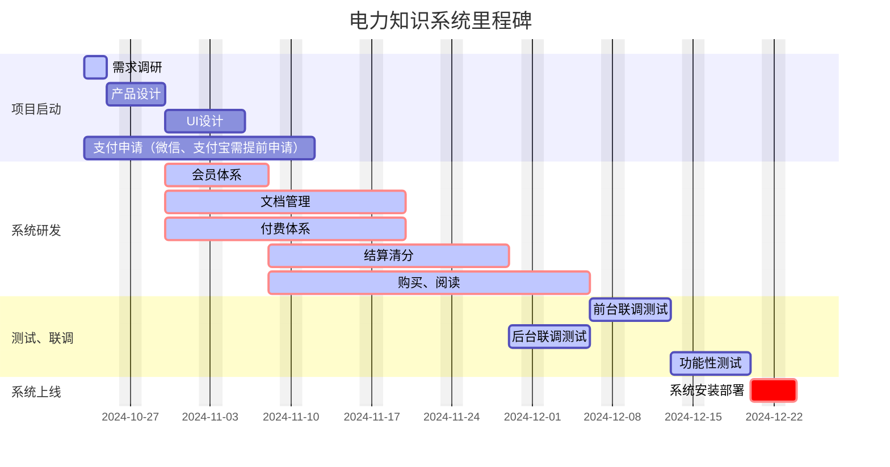

# 数据库

2023年统一受理线上办件统计：年办件量 1789627；2023年统一受理线下办件统计：年办件量 134906
豫事办反馈的日访问量约 200 万次，办事量约 20 万次。

备注: 

* mysql 行最大存储量暂定是 63.99 KB；
* 日均 = 年度总量 / 250 ; 
* 年度 = 年度总量;

| 年度 | 业务     | 日均数据量 | 年度数据量 |
| ---- | -------- | ---------- | ---------- |
| 2023 | 统一受理 | 447MB      | 109.2GB    |
| 2023 | 豫事办   | 12.2GB     | 3051GB     |
| 2024 | 表单中心 | 900MB      | 219GB      |
|      |          |            |            |
|      |          |            |            |

# 服务器

系统：linux
CPU：16核
内存：32G
磁盘：1T SSD
带宽：100M
台数：4台 (流程+表单  主备服务器)

数据库
数据增长按照 统一受理2023年度 109GB * 2 ，每年 200GB，预留备份空间，冗余 1T

