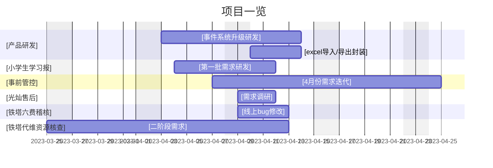
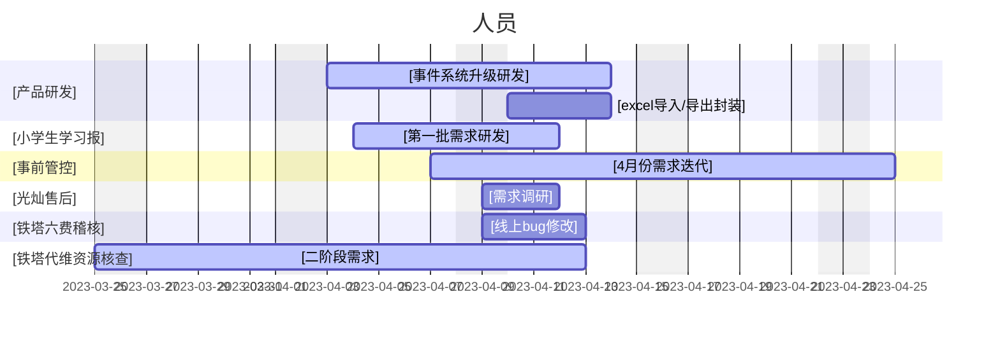
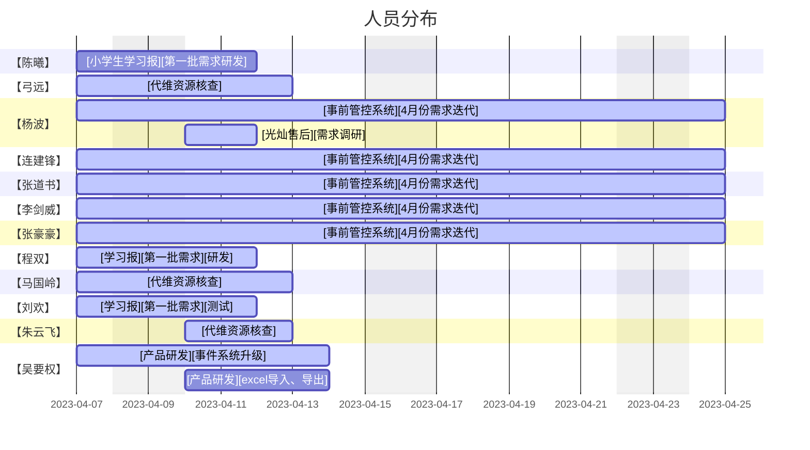
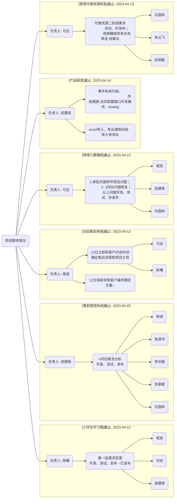
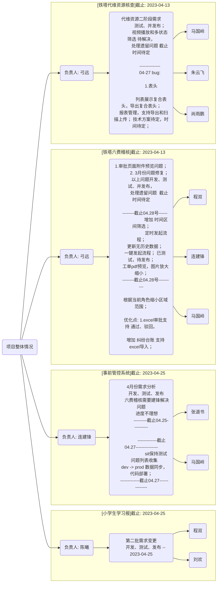
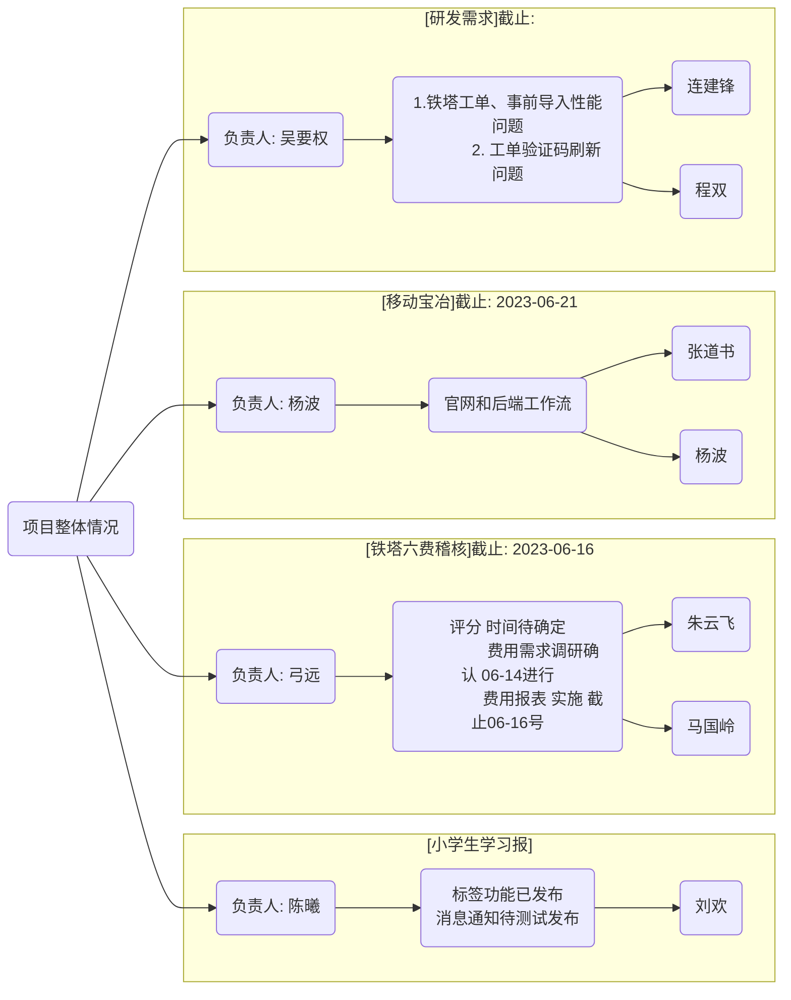

## 项目一览

<!--more-->

```mermaid
gantt
title 项目一览
dateFormat YYYY-MM-DD
excludes weekends
section [产品研发]
[事件系统升级研发] :a1, 2023-04-03,2023-04-14
[excel导入/导出封装] :a2, 2023-04-10,2023-04-14
section [小学生学习报]
[第一批需求研发] :b2,2023-04-04,6d
section [事前管控]
[4月份需求迭代] :c2,2023-04-07,2023-04-25
section [光灿售后]
[需求调研] :d2,2023-04-09,2023-04-12
section [铁塔六费稽核]
[线上bug修改] :e1,2023-04-09,2023-04-13
section [铁塔代维资源核查]
[二阶段需求] :f2,2023-03-25,2023-04-13


```

```mermaid
gantt
title 人员
dateFormat YYYY-MM-DD
excludes weekends
section [产品研发]
[事件系统升级研发] :active, a1, 2023-04-03,2023-04-14
[excel导入/导出封装] :a2, 2023-04-10,2023-04-14
section [小学生学习报]
[第一批需求研发] :active,b2,2023-04-04,6d
section [事前管控]
[4月份需求迭代] :active, c2,2023-04-07,2023-04-25
section [光灿售后]
[需求调研] :d2,2023-04-09,2023-04-12
section [铁塔六费稽核]
[线上bug修改] :e1,2023-04-09,2023-04-13
section [铁塔代维资源核查]
[二阶段需求] :active,f2,2023-03-25,2023-04-13


```

```mermaid
gantt
    dateFormat  YYYY-MM-DD
    title       人员分布
    excludes    weekends
 section 【陈曦】
 	[小学生学习报][第一批需求研发] :a2,2023-04-07,2023-04-12
 section 【弓远】
 	[代维资源核查] :active,a1,2023-04-07,2023-04-13
 section 【杨波】
 	[事前管控系统][4月份需求迭代] :active,a1,2023-04-07,2023-04-25
 	[光灿售后][需求调研] :active,a1,2023-04-10,2023-04-12
 section 【连建锋】
 	[事前管控系统][4月份需求迭代] :active,a1,2023-04-07,2023-04-25
 section 【张道书】
 	[事前管控系统][4月份需求迭代] :active,a1,2023-04-07,2023-04-25
 section 【李剑威】
 	[事前管控系统][4月份需求迭代] :active,a1,2023-04-07,2023-04-25
 section 【张豪豪】
 	[事前管控系统][4月份需求迭代] :active,a1,2023-04-07,2023-04-25
 section 【程双】
 	[学习报][第一批需求][研发] :active,a1,2023-04-07,2023-04-12
 section 【马国岭】
 	[代维资源核查] :active,a1,2023-04-07,2023-04-13
 section 【刘欢】
 	[学习报][第一批需求][测试] :active,a1,2023-04-07,2023-04-12
 section 【朱云飞】
 	[代维资源核查] :active,a1,2023-04-10,2023-04-13
 section 【吴要权】
 	[产品研发][事件系统升级] :active,a1,2023-04-07,2023-04-14
 	[产品研发][excel导入、导出] :a1,2023-04-10,2023-04-14

```

```mermaid
%%{init: {"flowchart": {"htmlLabels": false}} }%%
flowchart LR
a("项目整体情况")
subgraph "[产品研发]截止:  2023-04-14"
	b1("负责人: 吴要权")
  b1 --> b2("事件系统升级，
  					传统建表,动态配置接口开发模式; - testing")
  b1 --> b3("excel导入、导出通用封装 - 导入待测试")
end
subgraph "[小学生学习报]截止: 2023-04-12"
  c1("负责人: 陈曦")
  c1 --> c2("第一批需求变更
        开发、测试、发布  --已发布")
  c2 --> c3("程双")
  c2 --> c4("刘欢")
  c2 --> c5("连建锋")
end

subgraph "[事前管控系统]截止: 2023-04-25"
  d1("负责人: 连建锋")
  d1 --> d2("4月份需求分析
        开发、测试、发布")
  d2 --> d3("杨波")
  d2 --> d4("张道书")
  d2 --> d5("李剑威")
  d2 --> d6("张豪豪")
  d2 --> d7("马国岭")
end

subgraph "[光灿售后系统]截止: 2023-04-12"
  e1("负责人: 杨波")
  e1 --> e2("12日之前和客户约定时间
              确定售后流程和项目立项")
  e2 --> e3("弓远")
  e2 --> e4("陈曦")
  e1 --> e5("12日调研完和客户最终确定方案--")
end


subgraph "[铁塔六费稽核]截止: 2023-04-13"
  f1("负责人: 弓远")
  f1 --> f2("1.审批页面附件预览问题；
             2. 3月份问题修复；
             以上问题开发、测试、并发布")
  f2 --> f3("程双")
  f2 --> f4("连建锋")
  f2 --> f5("马国岭")
end


subgraph "[铁塔代维资源核查]截止: 2023-04-13"
  g1("负责人: 弓远")
  g1 --> g2("代维资源二阶段需求
              测试、并发布；
              视频播放和多状态筛选 待解决")
  g2 --> g3("马国岭")
  g2 --> g4("朱云飞")
  g2 --> g5("尚雨鹏")
end


a --> b1 & c1 & d1 & e1 & f1 & g1
```

```mermaid
%%{init: {"flowchart": {"htmlLabels": false}} }%%
flowchart LR
a("项目整体情况")
subgraph "[小学生学习报]截止: 2023-04-25"
  c1("负责人: 陈曦")
  c1 --> c6("第二批需求变更
        开发、测试、发布 -- 2023-04-25")
  c6 --> c7("程双")
  c6 --> c8("刘欢")
end

subgraph "[事前管控系统]截止: 2023-04-25"
  d1("负责人: 连建锋")
  d1 --> d2("4月份需求分析
        开发、测试、发布
         六费稽核需要建锋解决问题
         进度不理想
		---------截止04.25----------

		 -------------截止04.27---------------
			sit保持测试
     问题列表收集
     dev -> prod 数据同步，代码部署；
     -------------截止04.27--------------


 ")
  d2 --> d4("张道书")
  d2 --> d7("马国岭")
end

subgraph "[铁塔六费稽核]截止: 2023-04-13"
  f1("负责人: 弓远")
  f1 --> f2("1.审批页面附件预览问题；
             2. 3月份问题修复；
             以上问题开发、测试、并发布，
             处理遗留问题  截止时间待定

      --------截止04.28号------
			增加 时间区间筛选；
			定时发起流程；
      更新无历史数据；
      一键发起流程； 已测试，待发布；
       工单pdf预览，图片放大缩小；
       --------截止04.28号----------

       根据当前角色缩小区域范围；

       优化点: 1.excel审批支持 通过、驳回。

       增加 纠纷台账 支持excel导入；
")
  f2 --> f3("程双")
  f2 --> f4("连建锋")
  f2 --> f5("马国岭")
end


subgraph "[铁塔代维资源核查]截止: 2023-04-13 "
  g1("负责人: 弓远")
  g1 --> g2("代维资源二阶段需求
              测试、并发布；
              视频播放和多状态筛选 待解决，
              处理遗留问题 截止时间待定

              --------------
              04-27 bug:
							1.表头

		列表展示复合表头，导出复合表头；
    报表管理，支持导出和扫描上传； 技术方案待定，时间待定；
    ")
  g2 --> g3("马国岭")
  g2 --> g4("朱云飞")
  g2 --> g5("尚雨鹏")
end


a --> c1 & d1  & f1 & g1
```

```mermaid
%%{init: {"flowchart": {"htmlLabels": false}} }%%
flowchart LR
a("项目整体情况")
subgraph "[小学生学习报]"
  c1("负责人: 陈曦")
  c1 --> c6("标签功能已发布
  						消息通知待测试发布")
  c6 --> c8("刘欢")
end


subgraph "[铁塔六费稽核]截止: 2023-06-16"
  f1("负责人: 弓远")
  f1 --> f2("评分 时间待确定
                费用需求调研确认 06-14进行
                费用报表 实施 截止06-16号")
  f2 --> f4("朱云飞")
  f2 --> f5("马国岭")
end


subgraph "[移动宝冶]截止: 2023-06-21"
  e1("负责人: 杨波")
  e1 --> e2("官网和后端工作流")
  e2 --> e4("张道书")
  e2 --> e5("杨波")
end


subgraph "[研发需求]截止: "
  b1("负责人: 吴要权")
  b1 --> b2("1.铁塔工单、事前导入性能问题
             2. 工单验证码刷新问题")
  b2 --> b4("连建锋")
  b2 --> b5("程双")
end


a --> c1 & f1 & e1 & b1
```

