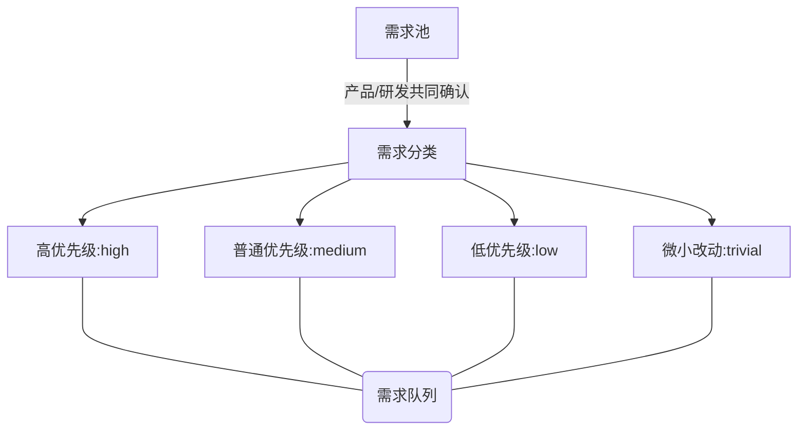
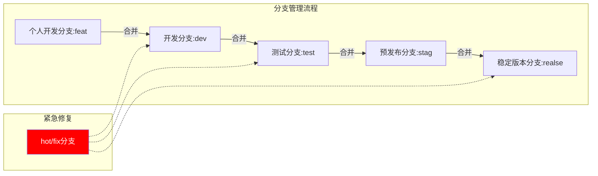
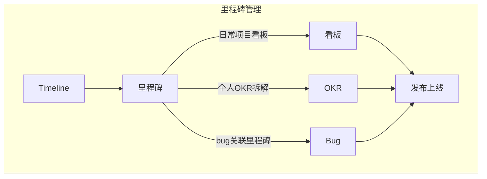
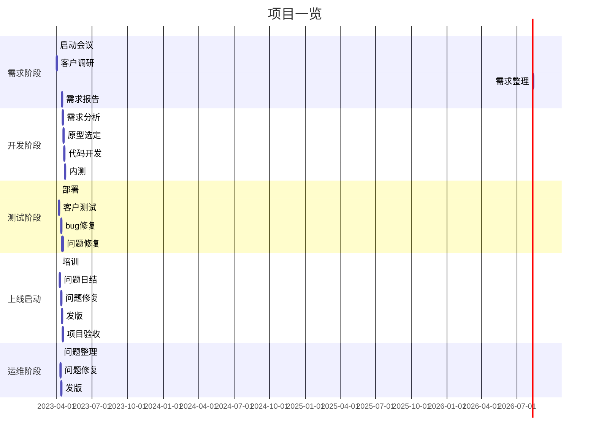
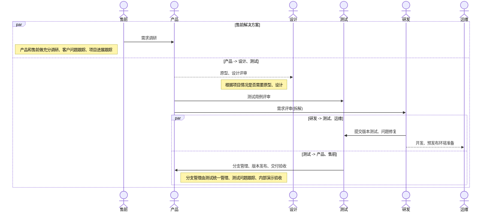

>本文章围绕gitlab 和 OKR，使用gitlab已有功能，进行项目管理、问题追踪和开发流程规范。

<!--more-->

## 需求管理

## 版本管理

## 里程碑管理

里程碑可以是具体的项目、要发布的版本、特定的研发类需求...

里程碑作为【售前】【产品】【研发】 【测试】【运维】目标（O）

根据目标来拆解各自的KR。

* **售前: 跟踪项目进展、时间把控；客户问题沟通；**

* 产品: 跟进项目进展、业务答疑；测试跟进；

* **研发: 完成既定研发目标；项目进展反馈；**

* 测试: 测试方案推敲；

* 运维: 准备开发、测试、预发布环境；

## 工作流程

1. 需求分析：首先，需要了解客户的需求，并定义项目的目标、范围和可交付成果。
2. 规划阶段：在这一阶段，需要确定项目的资源、时间表和预算。制定项目计划，并确定项目的关键里程碑和交付时间。
3. 执行阶段：在这一阶段，需要跟踪项目的进度，分配任务，并确保项目按计划进行。确保与客户和利益相关者进行沟通和协调。
4. 控制阶段：在这一阶段，需要监控项目的进度和成本，并及时采取纠正措施。需要定期评估项目的绩效和成果，并与客户和利益相关者分享进展。
5. 收尾阶段：在这一阶段，需要完成项目并提交可交付成果。需要评估项目的成功和教训，并为下一个项目做准备。

此外，以下是一些有助于软件项目管理的最佳实践：

- 使用项目管理软件：使用项目管理软件可以帮助您轻松跟踪任务、资源、时间表和预算。
- 与利益相关者沟通：确保您与客户、团队成员和其他利益相关者进行沟通和协调。
- 采用敏捷开发方法：敏捷开发方法强调快速反馈和快速迭代，可以帮助您更快地实现项目目标。
- 风险管理：在整个项目周期内，您需要识别和管理风险，并制定应对措施。
- 团队管理：鼓励团队成员进行有效的协作和沟通，并激励他们为项目成功做出贡献。
- 持续学习：了解新的技术和工具，以保持对软件项目管理最新的见解和技能。
