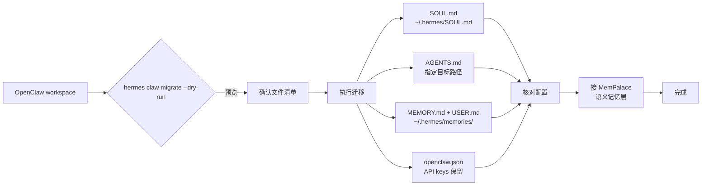

## 为什么要换

用 OpenClaw 一段时间后，有几个问题实在忍不了。

任务一多，换个 session 上下文就没了。调试时想找之前的思路，找不到；换个方式问同样的问题，AI 给的答案和上次完全不一样。记忆管理基本靠手功——key 命名看心情，同一条信息被存三五份是常事。

换 Hermes 的原因就一个：**它真的能记住上下文，跨 session 不会断。**

## 迁移了什么

### 记忆文件

OpenClaw workspace 里有几个核心文件：

- `SOUL.md` — 人设/性格设定
- `AGENTS.md` — 工作指令集
- `MEMORY.md` — 长期记忆
- `USER.md` — 用户信息

迁移之后分散到了不同位置：`SOUL.md` 进了 `~/.hermes/SOUL.md`，`AGENTS.md` 要手动指定目标路径，`MEMORY.md` 和 `USER.md` 解析后写入了 `~/.hermes/memories/`。

`hermes claw migrate` 可以自动迁移，但默认是 `--dry-run` 只预览不执行，别漏了这个参数。

### Skill

OpenClaw 的 skill 和 Hermes 不完全兼容。迁移之后要重装，部分自定义 skill 要么重新写，要么直接放弃。

### 配置

OpenClaw 的 `openclaw.json` 里存储了 API keys 和各种配置项。迁移时这些配置默认会保留，但建议迁移完之后仔细核对一遍，特别是 API 相关的配置。

## Hermes 的记忆系统是什么样的

Hermes 内置记忆分三层：

**短期记忆** 通过 system prompt 注入，受 token 限制，大概 2200 字符。**用户 Profile** 存在 `~/.hermes/memories/USER.md`，以 `§` 分隔条目。**长期记忆**是内置记忆的主力，key-value 读写，支持跨 session 持久化。

比 OpenClaw 强不少，但还有问题：读取依赖精确 key，自然语言描述一变就匹配不上。所以我又接了 MemPalace 做语义记忆层，专门解决这个问题。

## 迁移后遇到的问题

**记忆丢失**是第一个坎。新系统对之前的项目上下文一无所知，要手动把 MEMORY.md 迁移过来，重新建立记忆规范。这个工作量不小，之前积累的那些碎片知识大部分要重新喂一遍。

**Skill 兼容性**是第二个。有些在 OpenClaw 上跑得好好的自定义 skill，Hermes 上面直接废掉了。不是语法问题，是整个运行环境不一样。

**配置不一致**是第三个。迁移工具保留了大部分配置，但路径相关的设置还是要自己过一遍。

## 两个平台的记忆系统对比

| | OpenClaw | Hermes |
|---|---|---|
| 记忆持久化 | 文件为主，session 之间不共享 | key-value，支持跨 session |
| 语义搜索 | 无 | 无（需借助外部插件） |
| 记忆容量 | 受文件大小限制 | 受 token 限制，约 2200 字符 |
| 迁移工具 | `hermes claw migrate` | 内置，支持预览 |
| Skill 生态 | 独立体系 | Hermes 专属 |

## 迁移流程图

## 踩过的坑

**坑一：AGENTS.md 没指定路径就被跳过了。** 第一次跑迁移命令，没加 `--workspace-target`，AGENTS.md 直接被跳过。直到发现 Agent 行为和之前不一样，才发现指令集根本没迁移过来。

**坑二：Skill 迁移完之后路径全变了。** OpenClaw 的 skill 放在 `~/.openclaw/skills/`，Hermes 在 `~/.hermes/skills/`。脚本不负责迁移 skill，重新安装花了不少时间。

**坑三：Session 切换后记忆恢复慢。** Hermes 虽然支持跨 session 记忆，但刚迁移完 Agent 对老项目完全没上下文。需要主动把之前 MEMORY.md 的内容通过 MemPalace 重建一遍，不是自动的。

## 总结

从 OpenClaw 到 Hermes，最大的收获是记忆持久化和 session 管理。对需要长期跟踪任务、跨会话保持上下文的人来说，这步迁移值。但 Hermes 内置记忆仍有语义匹配的短板，建议配合 MemPalace 使用。

迁移本身不算复杂，`hermes claw migrate` 能处理大部分文件迁移工作，主要工作量在 skill 重装和配置核对。
