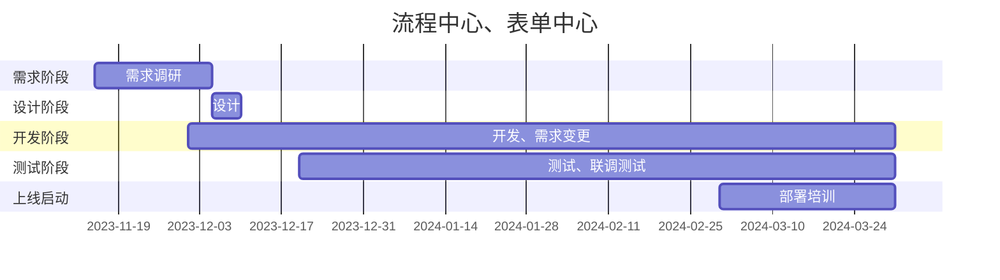
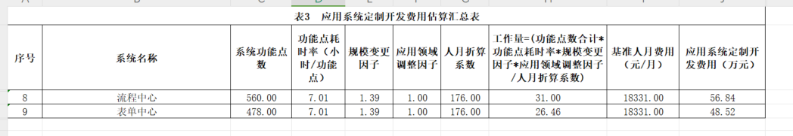

# 项目进度:

::: tips

### 项目成本核算

正数内部计算公式

:::

* 功能点耗时率:  7.01 小时/功能点   《中国软件行业基准数据》
* 规模变更因子:  1.39  参考 《中国软件行业基准数据》 
* 应用领域调整因子: 1 业务处理 
* 人月折算系统:  8 * 22 176

## 最终核算公式:  

>  工作量 = （功能点合计 X 耗时率） X 变更因子 X 领域调整因子  / 人月折算

## 正数评估: 

## 国立评估:

|              | 功能点 | 人月  | 人力  |
| ------------ | ------ | ----- | ----- |
| 一期表单中心 | 765    | 42.3  | 66.7W |
| 一期流程中心 | 595    | 32.94 | 51.9W |
| 二期表单中心 | 185    | 10.2  | 16.1W |
|              |        |       |       |

