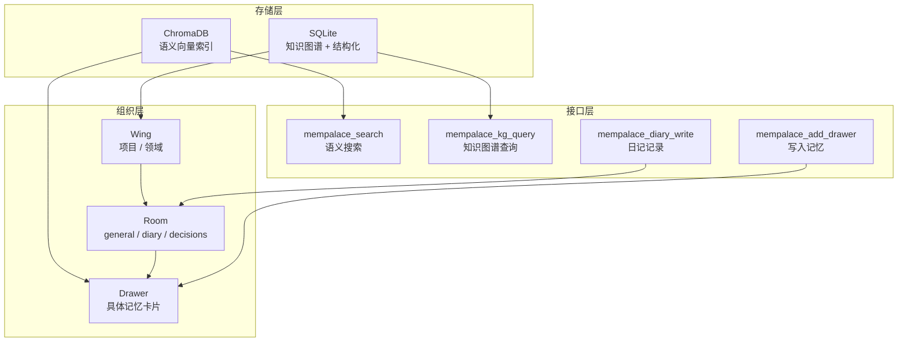
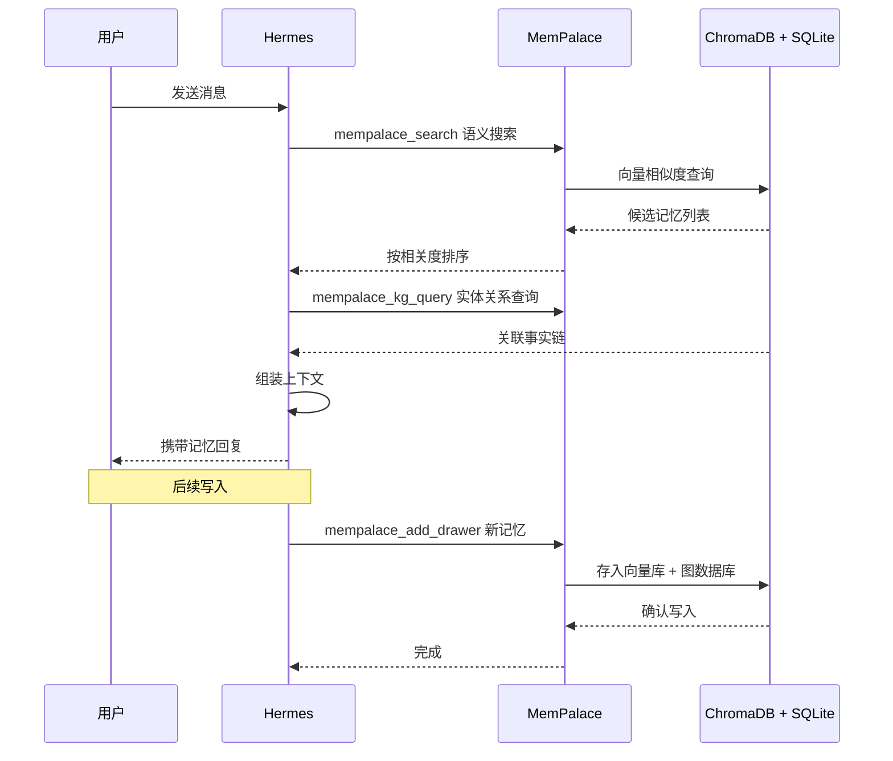

## 背景：Hermes 内置记忆有什么问题

Hermes Agent 有一套内置的记忆系统，基于简单 key-value 存储。每次写入时指定一个 key，读取时用同样的 key 把它取出来。

实际用下来，问题很具体：

- **表达一变就找不到**：上次记住的是"截图工具"，用户说"微信截图"就匹配不上
- **key 不一致导致重复存储**：同一个信息有人用 `project-path` 做 key，有人用 `paths` 做 key，查的时候不知道用哪个
- **没有语义理解**：搜"认证失败"搜不到"401错误"，因为字符串上完全不相关
- **session 结束后基本清零**：换一个 session，上下文全没了，除非手动迁移 memory 内容

核心问题是：**读取依赖精确匹配，而自然语言本身就是模糊的。**

## 改造思路

Hermes Agent 支持 MemoryProvider 插件接口，外部可以接入不同的记忆后端。目标是接一个支持语义搜索的记忆系统——写入时按原样存，读取时按意思搜。

选的是 MemPalace，本地语义记忆库，ChromaDB 做向量索引，SQLite 做知识图谱和结构化存储。架构上分三层：

接入 Hermes 之后，记忆读写流程变成了：

## 原则

改造后 Hermes 的记忆规则：

1. **读取全走 MemPalace** — 每次收到消息，先搜索相关记忆，不依赖内置 key-value
2. **写入全走 MemPalace** — 项目信息、用户偏好、待办事项，统统写入 MemPalace
3. **cronjob 自动归档** — 每 30 分钟自动把 session 进展写入 diary room，防止断电丢失

内置 memory 工具仅保留一项职责：存储 MemPalace 的路径配置。

## 踩过的坑

**1. 内置 memory 和 MemPalace 并存时的优先级**

刚接进去时，两者都在，导致同一个信息存了两份，读取时有时候命中内置 memory，有时候命中 MemPalace，结果不稳定。解决办法是彻底禁用内置 memory 的写入通道，只保留读取用于兼容旧逻辑。

**2. embedding 模型选择影响搜索质量**

MemPalace 的搜索质量依赖 embedding 模型。最早用的模型对中文语义理解偏弱，"登录失败"和"认证异常"这类近义表述匹配不上。换了支持中文的 embedding 模型之后，召回率明显提升。

**3. 知识图谱和向量搜索的分工**

最初想把所有关系都塞进知识图谱，结果图数据膨胀得很快，查询延迟也上来了。后来把频繁更新、时序敏感的（如 session 进度）放在向量库，把稳定事实（项目路径、技术栈、用户偏好）放在知识图谱，分开查询再合并结果。

**4. session 边界和记忆持久化的平衡**

每次 session 结束，Hermes 内部状态会清理，但 MemPalace 是持久化的。最早没做 session 隔离，同一个 Wing 下的记忆被多个 session 交叉污染。后来每个 session 的进展单独写进 diary room，稳定的项目信息写进 general room，泾渭分明。

## 效果

换 session 之后，上下文还在。"之前做到哪"能答上来，"那个 401 错误怎么处理的"能找出来，"用户偏好截图要整屏不要只截二维码"不会被忘掉。

搜"认证失败"，能找到"登录异常"、"401"、"token 过期"相关内容，不用猜 key 是什么。

## 注意

- MemPalace 是本地存储，多设备使用需要自己处理同步
- embedding 模型决定搜索上限，选型要结合自己的语料
- 长期运行后 sqlite 会膨胀，需要定期归档清理

## 改造前后对比

| | 内置 key-value 记忆 | MemPalace 语义记忆 |
|---|---|---|
| **读取方式** | 精确 key 匹配 | 语义向量相似度 |
| **检索能力** | 必须知道当初用什么 key | 描述需求即可，意思对就能找到 |
| **跨 session** | 完全丢失 | 持久化，换 session 上下文延续 |
| **中文语义** | 不支持 | 支持中文 embedding |
| **知识关联** | 无 | 知识图谱支持实体关系查询 |
| **存储结构** | 扁平的 key-value | Wings → Rooms → Drawers 分层 |
| **外部依赖** | 无 | 引入 MemPalace + ChromaDB |
| **运维成本** | 无 | 需维护本地 sqlite 和向量库 |

结论：代价是多引入一个本地依赖，换来的是检索可靠性、跨 session 记忆延续、中文语义理解。值不值看场景——偶尔用一次的 agent，key-value 够用；每天几十个任务、跨多项目的，语义记忆是刚需。

如果你的 Agent 也面临同样问题，可以从 MemoryProvider 接口入手，接入任意支持向量检索的后端都行，不一定是 MemPalace。
