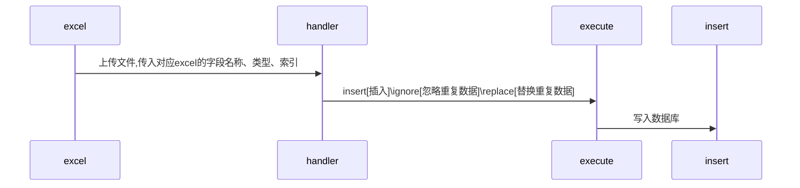
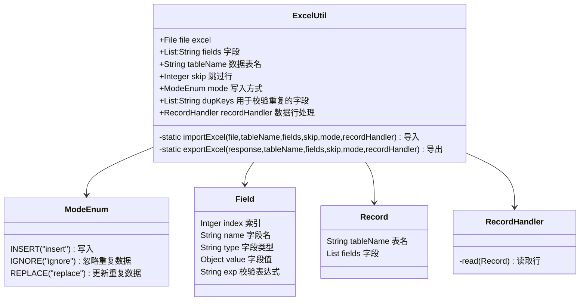

## 业务场景:

1. 上传excel按需写入字段；
2. 覆盖更新数据；

<!--more-->

## 设计方案

## mysql

1. insert into  table ()  select '' from dual where not exsits ()
2. insert ignore into id={IDGenerrate.gernxxx}
3. Insert into on dupli   update  xx=values()

Sql:

1. select id from table where dupKeys = ''
2. insert ignore into  values (id)

3. ignore :  insert into  table ()  select 'xx','x','xx from dual where not exsits ( select id from table where dupKeys = ''')

4. Insert into table ()  select 'x','id' from dual  on dupli   update  xx=values()

